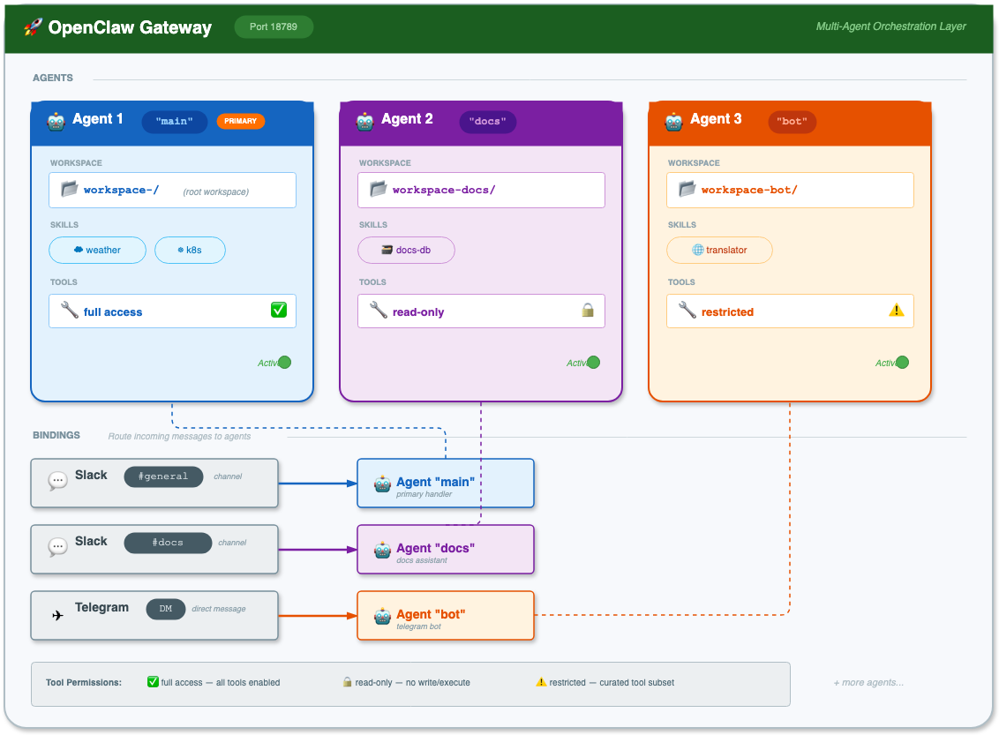

# OpenClaw Multi-Agent Guide

This guide covers running multiple isolated agents in a single OpenClaw deployment on Cloudeka.

## What is Multi-Agent?

Multi-agent allows you to run multiple isolated "brains" in one OpenClaw gateway:

- **Separate workspaces** — Each agent has its own files, AGENTS.md, SOUL.md
- **Separate state** — Each agent has its own auth profiles and sessions
- **Separate skills** — Each agent can have different skills installed
- **Message routing** — Bindings route messages to specific agents

## Use Cases

| Use Case | Description |
|----------|-------------|
| Multiple teams | Different agents for different Slack channels |
| Different personalities | Chat bot vs. code reviewer vs. incident responder |
| Permission boundaries | Restricted tools for untrusted channels |
| Multiple accounts | Different WhatsApp numbers for different purposes |

## Architecture



## Path Structure

Each agent has isolated paths on the PVC:

| Component | Path |
|-----------|------|
| Workspace | `/home/node/.openclaw/workspace-<agentId>/` |
| Agent state | `/home/node/.openclaw/agents/<agentId>/agent/` |
| Sessions | `/home/node/.openclaw/agents/<agentId>/sessions/` |
| Skills | `/home/node/.openclaw/workspace-<agentId>/skills/` |

## Complete Example: Two Agents

Let's set up two agents:
- **main** — General purpose, full tools, kubectl access
- **docs** — Documentation assistant with access to internal docs wiki

### Step 1: Update openclaw.json

Edit `charts/openclaw/values.yaml`:

```yaml
app-template:
  configMaps:
    config:
      data:
        openclaw.json: |
          {
            "gateway": {
              "port": 18789,
              "mode": "local",
              "trustedProxies": ["10.250.199.254"]
            },

            "browser": {
              "enabled": true,
              "defaultProfile": "default",
              "profiles": {
                "default": {
                  "cdpUrl": "http://localhost:9222",
                  "color": "#4285F4"
                }
              }
            },

            "agents": {
              "defaults": {
                "model": {
                  "primary": "dekallm/zai/glm-4.7-fp8"
                },
                "userTimezone": "UTC",
                "timeoutSeconds": 600,
                "maxConcurrent": 1
              },
              "list": [
                {
                  "id": "main",
                  "default": true,
                  "workspace": "/home/node/.openclaw/workspace-main",
                  "identity": {
                    "name": "OpenClaw Main",
                    "emoji": "🦞"
                  }
                },
                {
                  "id": "docs",
                  "workspace": "/home/node/.openclaw/workspace-docs",
                  "agentDir": "/home/node/.openclaw/agents/docs/agent",
                  "identity": {
                    "name": "Docs Helper",
                    "emoji": "📚"
                  },
                  "model": {
                    "primary": "dekallm/zai/glm-4.7-fp8"
                  },
                  "tools": {
                    "allow": ["read", "write", "edit"],
                    "deny": ["exec", "browser"]
                  }
                }
              ]
            },

            "models": {
              "mode": "merge",
              "providers": {
                "dekallm": {
                  "baseUrl": "https://dekallm.cloudeka.ai/v1",
                  "apiKey": "${DEKALLM_API_KEY}",
                  "api": "openai-completions",
                  "models": [{ "id": "zai/glm-4.7-fp8", "name": "GLM 4.7" }]
                }
              }
            },

            "session": {
              "scope": "per-sender",
              "store": "/home/node/.openclaw/sessions",
              "reset": {
                "mode": "idle",
                "idleMinutes": 60
              }
            },

            "logging": {
              "level": "info",
              "consoleLevel": "info",
              "consoleStyle": "compact",
              "redactSensitive": "tools"
            },

            "tools": {
              "profile": "full",
              "web": {
                "search": { "enabled": false },
                "fetch": { "enabled": true }
              }
            },

            "channels": {
              "telegram": {
                "botToken": "${TELEGRAM_BOT_TOKEN}",
                "enabled": true
              },
              "slack": {
                "botToken": "${SLACK_BOT_TOKEN}",
                "appToken": "${SLACK_APP_TOKEN}",
                "enabled": true,
                "replyToMode": "all",
                "channels": {
                  "C0AEWJDTED6": { "allow": true, "requireMention": false },
                  "C0INCIDENTS": { "allow": true, "requireMention": false }
                }
              }
            },

            "hooks": {
              "enabled": true,
              "token": "${OPENCLAW_HOOKS_TOKEN}"
            },

            "bindings": [
              {
                "agentId": "docs",
                "match": {
                  "channel": "slack",
                  "peer": { "kind": "group", "id": "C0DOCS" }
                }
              },
              {
                "agentId": "main",
                "match": { "channel": "slack" }
              },
              {
                "agentId": "main",
                "match": { "channel": "telegram" }
              }
            ]
          }
```

### Step 2: Configure Per-Agent Kubeconfigs

```yaml
app-template:
  persistence:
    # Kubeconfig for "main" agent
    kubeconfig-main:
      enabled: true
      type: secret
      name: openclaw-kubeconfig-main
      advancedMounts:
        main:
          main:
            - path: /home/node/.openclaw/workspace-main/.kube/config
              subPath: config
              readOnly: true

    # Kubeconfig for "docs" agent (read-only cluster access)
    kubeconfig-docs:
      enabled: true
      type: secret
      name: openclaw-kubeconfig-docs
      advancedMounts:
        main:
          main:
            - path: /home/node/.openclaw/workspace-docs/.kube/config
              subPath: config
              readOnly: true
```

Create the secrets:

```bash
# Full access for main
kubectl create secret generic openclaw-kubeconfig-main \
  --from-file=config=/path/to/kubeconfig-full.yaml \
  -n openclaw

# Read-only for docs
kubectl create secret generic openclaw-kubeconfig-docs \
  --from-file=config=/path/to/kubeconfig-readonly.yaml \
  -n openclaw
```

### Step 3: Configure Per-Agent Skills

```yaml
app-template:
  persistence:
    # Weather skill for main agent
    main-weather-skill:
      enabled: true
      type: configMap
      name: weather-skill
      advancedMounts:
        main:
          main:
            - path: /home/node/.openclaw/workspace-main/skills/weather/SKILL.md
              subPath: SKILL.md
              readOnly: true

    # Wiki skill for docs agent
    docs-wiki-skill:
      enabled: true
      type: configMap
      name: docs-wiki-skill
      advancedMounts:
        main:
          init-skills:
            - path: /tmp/skills/docs
              readOnly: true

    # MCP config for docs agent
    docs-mcporter-config:
      enabled: true
      type: configMap
      name: docs-mcporter-config
      advancedMounts:
        main:
          main:
            - path: /home/node/.openclaw/workspace-docs/config/mcporter.json
              subPath: mcporter.json
              readOnly: true
```

### Step 4: Update init-skills for Multi-Agent

```yaml
app-template:
  controllers:
    main:
      initContainers:
        init-skills:
          command:
            - sh
            - -c
            - |
              log() { echo "[$(date -Iseconds)] [init-skills] $*"; }
              log "Starting skills initialization"

              # ============================================================
              # Runtime Dependencies (shared)
              # ============================================================
              mkdir -p /home/node/.openclaw/bin
              if [ ! -f /home/node/.openclaw/bin/uv ]; then
                log "Installing uv..."
                curl -LsSf https://astral.sh/uv/install.sh | env UV_INSTALL_DIR=/home/node/.openclaw/bin sh
              fi

              mkdir -p /home/node/.openclaw/node_modules/.bin
              if [ ! -f /home/node/.openclaw/node_modules/.bin/mcporter ]; then
                log "Installing mcporter..."
                cd /home/node/.openclaw && npm install mcporter
              fi

              # ============================================================
              # Extract Skill Archives (per-agent)
              # ============================================================
              for archive in /tmp/skills/*/skill.tar.gz; do
                if [ -f "$archive" ]; then
                  agent=$(basename "$(dirname "$archive")")
                  log "Extracting skills for agent: $agent"
                  # Extract to agent-specific workspace
                  tar xzf "$archive" -C "/home/node/.openclaw/workspace-$agent"
                fi
              done

              # ============================================================
              # Install ClawHub Skills (per-agent)
              # ============================================================
              # Agent: main
              mkdir -p /home/node/.openclaw/workspace-main/skills
              cd /home/node/.openclaw/workspace-main
              for skill in weather; do
                if [ -n "$skill" ] && [ ! -d "skills/${skill##*/}" ]; then
                  log "Installing skill for main: $skill"
                  npx -y clawhub install "$skill" --no-input || log "WARNING: Failed: $skill"
                fi
              done

              # Agent: docs
              mkdir -p /home/node/.openclaw/workspace-docs/skills
              cd /home/node/.openclaw/workspace-docs
              for skill in ; do
                if [ -n "$skill" ] && [ ! -d "skills/${skill##*/}" ]; then
                  log "Installing skill for docs: $skill"
                  npx -y clawhub install "$skill" --no-input || log "WARNING: Failed: $skill"
                fi
              done

              log "Skills initialization complete"
```

### Step 5: Deploy

```bash
helm upgrade openclaw ./charts/openclaw -n openclaw -f charts/openclaw/values.yaml
```

## Understanding Bindings

Bindings route inbound messages to agents using **most-specific wins**:

1. **`peer` match** (exact DM/group ID) — Highest priority
2. **`accountId`** match for a channel
3. **Channel-level** match
4. **Fallback** to default agent

### Binding Examples

```json
"bindings": [
  // Specific Slack group → docs agent
  {
    "agentId": "docs",
    "match": {
      "channel": "slack",
      "peer": { "kind": "group", "id": "C0INCIDENTS" }
    }
  },
  // Specific Telegram DM → bot agent
  {
    "agentId": "bot",
    "match": {
      "channel": "telegram",
      "peer": { "kind": "direct", "id": "15551234567" }
    }
  },
  // All Slack → main agent
  {
    "agentId": "main",
    "match": { "channel": "slack" }
  },
  // Everything else → main (default)
]
```

## Per-Agent Tool Restrictions

Restrict what tools each agent can use:

```json
{
  "agents": {
    "list": [
      {
        "id": "public-bot",
        "tools": {
          "allow": ["read", "sessions_list"],
          "deny": ["exec", "write", "edit", "browser"]
        }
      },
      {
        "id": "admin",
        // No restrictions — all tools available
      }
    ]
  }
}
```

### Available Tools

| Tool | Description |
|------|-------------|
| `exec` | Execute shell commands |
| `read` | Read files |
| `write` | Write files |
| `edit` | Edit files |
| `browser` | Browser automation |
| `sessions_*` | Session management |
| `agent_to_agent` | Agent messaging |

## Per-Agent Sandboxing

Isolate agents in Docker containers (requires OpenClaw v2026.1.6+):

```json
{
  "agents": {
    "list": [
      {
        "id": "trusted",
        "sandbox": {
          "mode": "off"  // No sandbox
        }
      },
      {
        "id": "untrusted",
        "sandbox": {
          "mode": "all",      // Always sandboxed
          "scope": "agent",   // One container per agent
          "docker": {
            "image": "node:20-alpine",
            "setupCommand": "apt-get update && apt-get install -y git curl"
          }
        }
      }
    ]
  }
}
```

## Testing Multi-Agent Setup

### Verify Agent Configuration

```bash
kubectl exec -n openclaw deployment/openclaw -- node dist/index.js agents list --bindings
```

Expected output:
```
┌──────────────┬──────────────────┬─────────────┐
│ Agent ID     │ Name             │ Bindings    │
├──────────────┼──────────────────┼─────────────┤
│ main         │ OpenClaw 🦞       │ slack, tg   │
│ docs         │ Docs Helper 📚    │ #docs       │
└──────────────┴──────────────────┴─────────────┘
```

### Test Message Routing

Send messages to different channels and verify the correct agent responds:

1. **Slack #docs** → Should get Docs agent (📚)
2. **Slack #general** → Should get Main agent (🦞)
3. **Telegram DM** → Should get Main agent (🦞)

## Sharing Skills Between Agents

To share skills across agents, use the shared skills directory:

```yaml
# Mount shared skill to both agents
shared-skill:
  enabled: true
  type: configMap
  name: common-skill
  advancedMounts:
    main:
      main:
        - path: /home/node/.openclaw/skills/common/SKILL.md
          subPath: SKILL.md
          readOnly: true
```

Or use symlinks in init-skills:

```bash
# Create symlink in each agent's workspace
ln -s /home/node/.openclaw/skills/common /home/node/.openclaw/workspace-main/skills/common
ln -s /home/node/.openclaw/skills/common /home/node/.openclaw/workspace-docs/skills/common
```

## Common Patterns

### Pattern 1: Channel-Based Routing

Route entire channels to different agents:

```json
"bindings": [
  { "agentId": "support", "match": { "channel": "slack", "peer": { "id": "C0SUPPORT" } } },
  { "agentId": "engineering", "match": { "channel": "slack", "peer": { "id": "C0ENG" } } }
]
```

### Pattern 2: Mention-Based Routing

Route @mentions to a specialized agent:

```json
"bindings": [
  { "agentId": "code-reviewer", "match": { "channel": "slack", "peer": { "id": "C0ENG" } } }
]
```

Then in the agent config:

```json
{
  "id": "code-reviewer",
  "groupChat": {
    "mentionPatterns": ["@review", "@reviewer", "@Code Review"]
  }
}
```

### Pattern 3: Account-Based Routing

Different WhatsApp accounts to different agents:

```json
"channels": {
  "whatsapp": {
    "accounts": {
      "personal": { "authDir": "~/.openclaw/credentials/whatsapp/personal" },
      "business": { "authDir": "~/.openclaw/credentials/whatsapp/business" }
    }
  }
},
"bindings": [
  { "agentId": "personal", "match": { "channel": "whatsapp", "accountId": "personal" } },
  { "agentId": "work", "match": { "channel": "whatsapp", "accountId": "business" } }
]
```

## Next Steps

- [Configuration Guide](./02-configuration.md) - More on agents and bindings
- [Skills Guide](./03-skills.md) - Adding per-agent skills
